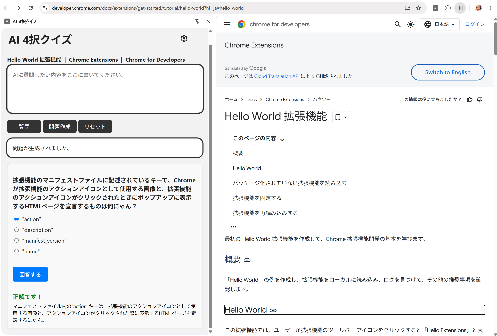

# このChrome拡張機能について

このChrome拡張機能は、Gemini APIを使用して、アクティブなウェブページから四択問題を作成することができます。

- 質問ボタン
    入力された質問に対し、問題を作成したウェブページの内容を元に、質問に回答します。
- 問題作成ボタン
    アクティブなウェブページの内容を元に、四択問題を作成します。
    - 選択肢を選んで回答すると、正解か不正解かを表示します。
- リセットボタン
    質問応答、問題、問題の履歴をリセットします。
- 設定ボタン（歯車マーク）
    APIキーの設定、Temperature及びシステムプロンプトの設定ができます。
    また、取得するページのCSSセレクタの設定を変更することができます。

### 使用時のイメージ

---

# セットアップ手順

1.  Chrome拡張機能のzipファイルをインストールし、解凍します。
2.  Chromeの拡張機能ページ（chrome://extensions/）を開きます。
3.  右上の「デベロッパーモードをオンにする」トグルを切り替えます。
4.  「パッケージ化されていない拡張機能を読み込む」をクリックし、解凍したフォルダを選択します。
5.  拡張機能がインストールされ、アイコンが表示されます。
6.  アイコンをクリックすると、サイドパネルが表示されます。

---

# 初期設定

1.  右上の歯車マークをクリックして設定メニューを開きます。
2.  Gemini APIキーを入力します。

---

# 留意事項

設定画面に保存されたAPIキーは、ユーザーのChrome拡張機能のストレージに保存されます。

- 他のウェブサイト等からアクセスされることはありません。
- 拡張機能を削除すると、保存されたAPIキーは削除されます。